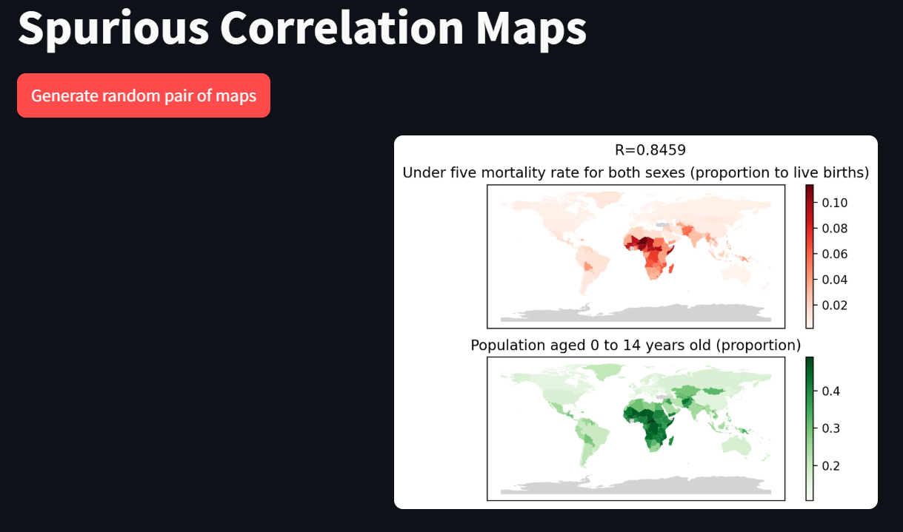

# SpuriousCorrelationMaps

A small project i'm doing to learn some basics of:
- Data manipulation: gather data from various sources, clean it, transform it, visualize it
- Web app deployment: some quick-and-dirty essentials to share a simple app to the world

The app is online [here](https://spuriouscorrelationmaps.streamlit.app).

It takes inspiration from the [Spurious Correlation](https://www.tylervigen.com/spurious-correlations) idea by Tyler Vigen, where pairs of timeseries data are checked for unlikely correlations. It is a playful way to remind us how not only that correlation does not imply causation, but that if enough data are compared, some correlation will eventually show up, even if it hides no deep meaning whatsoever.
My idea is to do something similar but with country-based data, which can be visualized by means of colorful maps. For example, it might be that population density happens to correlate well with daily listeners of a certain song? It is far from the maturity stage of the original SpuriousCorrelations website (and it will probably always be, as all it was is an exercise, really): what happens in SpuriousCorrelationMaps is that the user can click a button which will plot a random pair of country-based data, along with the Pearson correlation coefficient. One day I hope to have enough data that it makes sense to plot only the highly correlated ones.

Preview:

## Data sources
- https://data.un.org/
- https://www.kaggle.com/datasets/nelgiriyewithana/billionaires-statistics-dataset